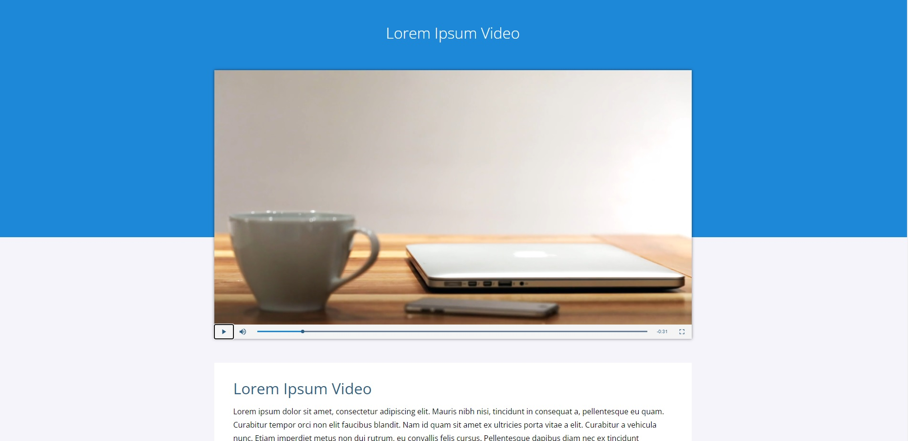

# VideoJS

In this practice I was testing the use of the VideoJS utility, in order to make use of a video player that can be customized to suit the consumer. Without a doubt, very useful and it looks great.

